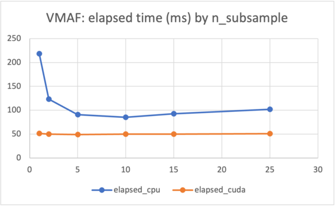

A collection of quick'n'dirty scripts to benchmark libvmaf, libvmaf\_cuda, and VMAF sampling.

Comparison of the time it takes to calculate VMAF on the CPU and GPU for different levels of subsampling .
The chart represents the elapsed time in milliseconds to calculate the VMAF for [Tears of steal](https://mirrors.dotsrc.org/blender/blender-demo/movies/ToS/tears_of_steel_1080p.webm), a 1080p reference vs a 480p distorted (upscaled to 1080p for the comparison). See [scripts/](scripts/) for details.

Find under [docker/](docker/)  how to build a docker image that builds both versions of libvmaf into FFmpeg.
